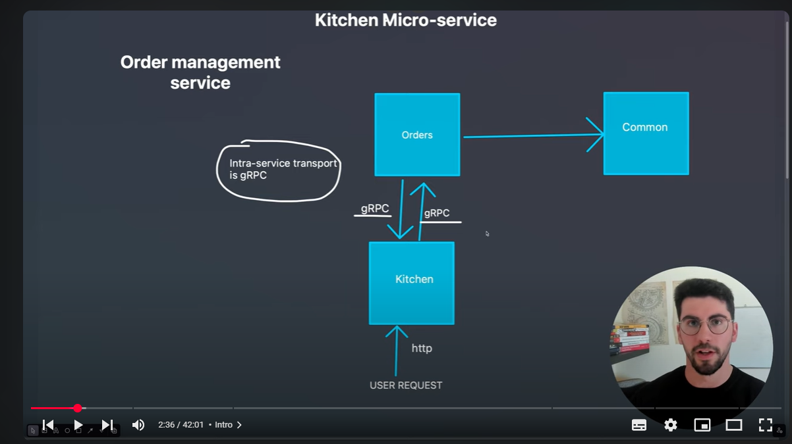

# GRPC (Remote procedure calls)

- modern communication framework.
- communicates via HTTP/2 and data is sent in binaries
- offers code generation via the protocol buffers which are like a contract for communication.
- define strucure of what you expect to send in a proto file.
- gRPC is a way for two programs(microservices) to talk to each other, especially when they're written in different languages or running on different computers.

**Analogy**

- Imagine you have two apps: A and B
- You want App A to ask App B to do sth.
- Intead of sending HTTP requests with JSON like REST, gRPC lets App A "call a function" that runs in App B- almost like calling afunction in your own code, but it actually runs in another program, on another server, possibly written in a different language.

**Strong typing**

- Structure of messages is defined in a "contract" called .proto file.
  **Automatic code generation**
- You don't manually write code to handle requests and responses; the gRPC tools generate a lot of that.

- Protocol buffers compiler (protoc) converts .proto files to code.

# System Architecture

# Generating code using protoc

- protoc \
  --proto_path=protobuf \
  --go_out=service/common/genproto/orders --go_opt=paths=source_relative \
  --go-grpc_out=service/common/genproto/orders --go-grpc_opt=paths=source_relative \
  protobuf/orders.proto

**proto_path**

- tells protoc where to find your .proto files
  **go_out**
- where to put the generated Go structs
  **go-grpc_out**
- where to put the generated Go service interface (gRPC server/client stubs)
